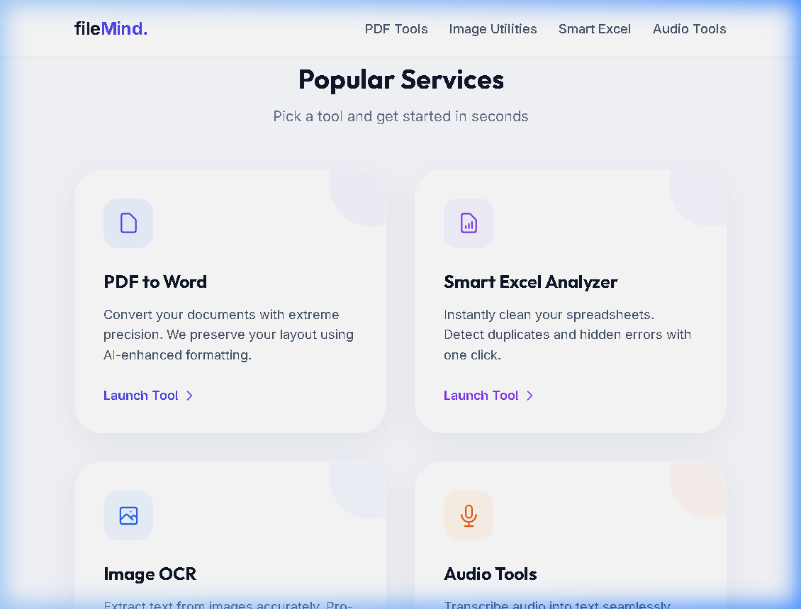
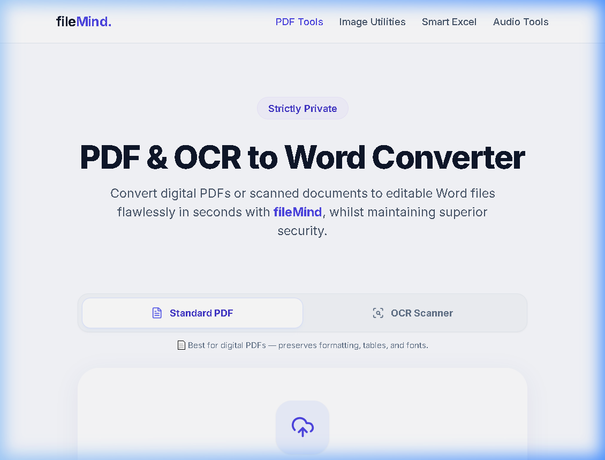

# 🚀 fileMind - Smart, Secure, & Fast Utility Platform

[](https://frontend-roan-seven-93.vercel.app/)
[](https://opensource.org/licenses/MIT)

**fileMind** is the ultimate productivity suite designed for modern workflows. It provides a comprehensive set of tools for PDF conversions, advanced image processing, and intelligent spreadsheet analysis—all built on a **Zero Permanent Storage** foundation to ensure maximum privacy and security.

🔗 **Live Demo:** [https://frontend-roan-seven-93.vercel.app/](https://frontend-roan-seven-93.vercel.app/)

---

## ✨ Key Features

### 📄 PDF Mastery
- **PDF to Word**: Convert complex documents with extreme precision, preserving layout and AI-enhanced formatting.
- **PDF Utilities**: Merge, split, and compress PDF files without compromising quality.

### 🖼️ Intelligent Image Tools
- **Image OCR**: Extract text from images accurately with pro-level support for Arabic and multi-language scripts.
- **Smart Compressor**: Reduce file sizes by up to 80% using our high-density compression engine.

### 📊 Smart Excel Analyzer
- Instantly clean your spreadsheets.
- Detect duplicates and hidden errors with a single click.

### 🎙️ Audio Transcription
- Transcribe audio into text seamlessly, perfect for notes, interviews, and logs.

---

## 📸 Screenshots

### 🖥️ Professional Landing Page


### 🛠️ Popular Services


### 📑 PDF Conversion Interface


---

## 🛡️ Security & Privacy
Built with a "Privacy First" mindset:
- **Zero Permanent Storage**: Your files are never stored longer than necessary.
- **1-Hour Self Destroy**: Files are automatically deleted after 1 hour.
- **AI Verified Results**: Ensures the highest accuracy for OCR and conversions.

---

## 🚀 Getting Started

### Prerequisites
- Node.js (Latest LTS)
- npm or yarn

### Installation
1. Clone the repository:
   ```bash
   git clone https://github.com/Maamoun0/filemind.git
   ```
2. Install dependencies:
   ```bash
   npm install
   ```
3. Run the development server:
   ```bash
   npm run dev
   ```

---

## 🛠️ Tech Stack
- **Frontend**: Next.js, React, Tailwind CSS
- **Backend**: Python (FastAPI), Node.js
- **Infrastructure**: Docker, Vercel
- **Security**: Zero-knowledge processing

---

## 📄 License
This project is licensed under the MIT License - see the [LICENSE](LICENSE) file for details.

---

Created with ❤️ by [Maamoun](https://github.com/Maamoun0)
