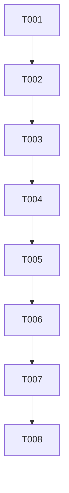

# Tasks: File Download Fix

**Feature**: File Download Fix | **Branch**: `004-fix-file-download`

## Implementation Strategy

We will follow an MVP-first approach, focusing initially on ensuring the backend correctly serves the file with proper headers and the frontend can ingest it regardless of cross-origin or proxy header stripping.

## Phase 1: Setup

- [x] T001 Verify `API_URL` consistency between frontend and backend in development and production environments.

## Phase 2: Foundational

- [x] T002 [P] Audit `hf_deploy/app/main.py` to confirm `CORSMiddleware` exposes `Content-Disposition`.

## Phase 3: User Story 1 - Successful File Download (Priority: P1)

**Goal**: Enable reliable file downloads across domains.  
**Independent Test**: Upload a file, process it, and download it successfully in a cross-origin environment.

- [x] T003 [US1] [P] Implement RFC 5987 compliant header generation in `hf_deploy/app/routers/tools.py`.
- [x] T004 [US1] Refactor `download_result` endpoint in `hf_deploy/app/routers/tools.py` to use explicit headers and `FileResponse`.
- [x] T005 [US1] [P] Refine `handleDownload` logic in `packages/frontend/src/components/FileUploader.tsx` to use `fetch` with `credentials: 'omit'` and `response.blob()`.

## Phase 4: User Story 2 - Support for Non-ASCII Filenames (Priority: P2)

**Goal**: Preserve Arabic filenames in downloads.  
**Independent Test**: Download a file with an Arabic name and verify it matches the original.

- [x] T006 [US2] Update `packages/frontend/src/components/FileUploader.tsx` to prioritize `filename*=` (UTF-8) in `Content-Disposition` parsing.

## Phase 5: User Story 3 - Error Recovery (Priority: P3)

**Goal**: Provide clear feedback on failure.  
**Independent Test**: Trigger a 404 error and verify the UI displays "File has expired or is no longer available."

- [x] T007 [US3] [P] Implement enhanced error catching in `packages/frontend/src/components/FileUploader.tsx` to parse JSON error details from the backend.

## Final Phase: Polish & Cross-Cutting Concerns

- [x] T008 [P] Add unified logging prefixes `[fileMind-Engine]` and `[fileMind-UI]` for cross-tier traceability.

## Dependencies

## Parallel Execution

- T003 and T005 can be developed in parallel as they define the contract and its consumption.
- T002 and T008 (logging part) can be done independently.
